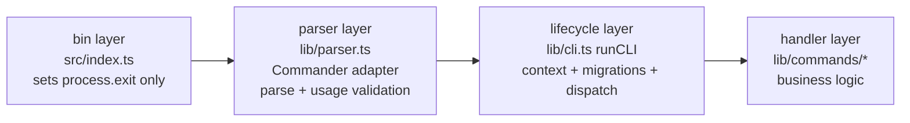

# 00 — CLI Architecture Overview

## Four-layer architecture

The CLI is a four-layer pipeline. The bin layer owns the normal success/error exit
mapping (`CliUsageError` → 2, anything else → 1); `watch` alone additionally owns its
graceful SIGINT exit code (130). Library code (`runCLI`) always throws instead of
exiting so embedded hosts (the VS Code extension) survive errors.



- **bin** (`packages/cli/src/index.ts:5-9`) — catches a rejected `runCLI()` and maps
  it to the exit code: `CliUsageError` → 2, anything else → 1. Success falls through to 0.
- **parser** (`packages/cli/src/lib/parser.ts:1-13`) — builds a Commander program from the
  command registry, produces a `ParsedInvocation`, and runs the shared semantic validator.
  Commander never owns the process: `exitOverride()`, all output through the `CliIO` sink,
  action handlers are capture-only.
- **lifecycle** (`packages/cli/src/lib/cli.ts:62-124`) — sets the interaction mode, wires
  global options (verbose/quiet/debug, `-C` anchor, transport), short-circuits pure
  invocations, runs store migrations, then dispatches.
- **handlers** (`packages/cli/src/lib/commands/*`) — business logic; reading flags via
  `hasFlag`/`extractFlag` and `ctx.options`, never parsing argv themselves.

Both hosts converge on one contract: the executable parses argv with `parseArgv()`, the
embedded API (`runCLI(cmd, args, {flags})`) structures its pre-split shape with
`normalizeLegacyInvocation()` — both produce a `ParsedInvocation` that goes through the
same `validateInvocation()` (`packages/cli/src/lib/parser.ts:425-490`).

## Source layout

```
packages/cli/src/
  index.ts          — Bin entry. Catch runCLI error → exit 2 (usage) or 1 (runtime).
  api.ts            — Library surface for embedders: runCLI, setProjectDir, logger, engines.
  lib/
    cli.ts          — runCLI() entry point. Parse → validate → executeInvocation().
    parser.ts       — Commander adapter, CliIO sink, CliUsageError, validateInvocation().
    registry.ts     — Command registry + FlagSpec/PositionalSpec schema (single source of truth).
    errors.ts       — CliError (Problem/Cause/Try) + formatError() pure renderer.
    interaction.ts  — InteractionMode + confirmDestructive() consent gate (sync, TTY-safe).
    json.ts         — Machine JSON envelope v1 (printJsonEnvelope).
    outcome.ts      — OperationOutcome severity + aggregate/throw helpers (exit matrix).
    args.ts         — Thin readers over the published invocation: hasFlag / extractFlag.
    expect.ts       — ArgTypeError, expect().
    helper.ts       — Project discovery (fail-closed), config read/write, outdir, experimental gate.
    templateManager.ts — Template cache, clone, scaffold, ignore filter, config store.
    transport.ts    — GitTransport (git clone/pull) / FetchTransport (fflate + HTTPS).
    doctor.ts       — runProjectDoctor() gatherer (NodeFileSystem + core engine).
    devsync.ts      — createDevSync() factory. BuildSession host adapter.
    watch-shared.ts — isWatchPathIgnored, resolveWatchVariants, WATCH_DEBOUNCE_MS.
    logger.ts       — Stream contract: log→stdout, info/warn/error/verbose→stderr.
    help.ts         — addHelp registry + helpCmd display (filters hidden commands).
    languages.ts    — PZ game language table (lang command, hidden stub).
    commands/       — 16 self-registering command files (see inventory below).
```

## Command inventory

Generated from the registry (`packages/cli/src/lib/registry.ts`) — the declared
`flags`/`positionals` metadata is the single source of truth for what each command
accepts, on both the executable and embedded paths. `*` marks a required positional.

| Command | Positionals | Command flags | Notes |
|---|---|---|---|
| `add` | `modName*` `[modId]` | `--offline`, `--force-update` | Rollback on failure (CLI-4) |
| `build` | — | `--production`, `--development`, `--both` | `silent` (no completed footer) |
| `clean` | — | — | `silent`; "Already clean." → exit 0 |
| `delete` | `modId*` | `--yes`, `--dry-run` | Consent gate (CLI-9) |
| `doctor` | — | `--game-build <v>`, `--json` | Verdict + exit 1 on errors |
| `help` | `[command]` | — | Pure invocation |
| `lang` | `modId*` `lang*` `[toLang]` | — | **Hidden** (CLI-7): runs but not listed |
| `list` | — | `--json` | Read-only |
| `migrate` | — | — | Works outside projects (global config only) |
| `modconfig` | `modId*` `[action...]` | — | Variadic action |
| `modinfo` | `action*` `[modId]` | `--force` | `silent` |
| `new` | `title*` `[modId]` | `--path <dir>`, `--offline`, `--force-update`, `--symlinks` | Atomic staging commit (CLI-4) |
| `outdir` | `path*` | — | Writes global config.json |
| `rename` | `oldModId*` `newModId*` | `--yes`, `--dry-run` | Consent gate (CLI-9) |
| `update` | — | — | Partial failure → exit 1 (CLI-6) |
| `watch` | — | `--production`, `--development`, `--both` | `silent`; owns SIGINT → 130 |

Global flags (parsed in every position, on the root program and every subcommand —
`packages/cli/src/lib/registry.ts:78-93`):

| Flag | Effect |
|---|---|
| `--verbose` | Enable diagnostic output (`[DEBUG]` lines on stderr) |
| `--quiet` | Suppress `info`/`verbose`; warnings and errors always print |
| `--debug` | Implies verbose; also unlocks stack traces for unexpected errors |
| `--transport <git\|fetch>` | Override template transport (validated choices) |
| `-C, --project <dir>` | Anchor project discovery to `<dir>` (CLI-5); never chdir |
| `--help` | Show help; short-circuits all other validation |

`lang` is registered with `hidden: true` (`packages/cli/src/lib/commands/lang.ts:17-30`):
the old route still works and `pzstudio help lang` prints its text, but the generated
command listing filters it (`packages/cli/src/lib/commands/help.ts:6-13`).

## Execution phases

1. **Interaction mode** (CLI-9) — decided once per invocation from the shape:
   legacy embedded shape → `embedded`; executable → `interactive` on a TTY, else
   `non-interactive` (`packages/cli/src/lib/cli.ts:78-84`).
2. **Parse phase** (pure) — argv → `ParsedInvocation` via Commander, or the embedded
   shape structured against the same registry schema. Usage errors throw `CliUsageError`.
3. **Validate phase** (pure) — unknown command (with did-you-mean), unknown option,
   choice values, positional arity. `--help` short-circuits arity on both paths.
4. **Execute phase** — global option wiring, then:
   - **Pure invocations** (`--help`, `--version`, no command, `help <cmd>`) print and
     return **before** any migration, config creation, discovery, or network.
   - **Real commands** run `migrateStoreDirIfNeeded()` + `migrateGlobalConfigIfNeeded()`,
     log a verbose (non-throwing) `Project Dir:` line, publish the invocation options,
     and call the handler.
5. **Exit** — handlers return (exit 0) or throw; the bin layer maps the throw to 1/2.

## Project guard

Nine commands require a project and throw the shared structured error
`No pzstudio project found.` (with a Cause/Try block) when discovery fails:
`add`, `build`, `clean`, `delete`, `list`, `modconfig`, `modinfo`, `rename`, `watch`.
`new` and `migrate` use non-throwing discovery; `doctor` requires a project via
`projectDir()` before the engine runs; `outdir` never resolves a project.
See `02-project-resolution.md`.

## Config file system

Config sources resolve by precedence, highest to lowest (first source that defines the
value wins — this is *not* a later-wins merge):

```
project.json  →  workspace settings (VS Code)  →  user settings (VS Code)  →  config.json  →  defaults
```

- **project.json** — project manifest: `workshop`, `mods`, `excludes`, `outdir`,
  `build.target`, `pzBuildCompatibility`, `experimental.integration` (opt-in, default
  **off** — BREAKING since CLI-10). See `07-config-files.md`.
- **~/.pzstudio/config.json** — global defaults: `templates`, `outdir`, `useSymlinks`,
  `experimental.integration`.
- **.pzstudioignore** — per-directory ignore rules for copy operations.

## Exit codes

| Code | Meaning | Examples |
|---|---|---|
| 0 | Success — including warnings-only results | `clean` with nothing to clean; `doctor` with warnings; `update` all-success |
| 1 | Runtime failure | any thrown `CliError`/unexpected error; `doctor` with ≥ 1 error finding; `update` with any failed category; `delete` unknown mod |
| 2 | Usage error (`CliUsageError`) | unknown command/flag, arity violations, bad `--transport` value, mutually exclusive options (e.g. `build --production --development`), `help <unknown>`, destructive command refused without `--yes` in a non-interactive or embedded session |
| 130 | SIGINT (Ctrl+C) during `watch` — one `Development sync stopped.` message, cleanup, exit |

`packages/cli/src/index.ts:8` is the only place that calls `process.exit`;
`runCLI` rethrows for embedders instead (`packages/cli/src/lib/cli.ts:109-121`).

## Template categories

Four categories are managed independently:
`project`, `mod`, `workshop`, `language`.

Each has its own cache path (`~/.pzstudio/templates/<user>/<repo>`) and is
refreshed independently. The `update` command refreshes all four and fails (exit 1)
if any category fails. See `03-template-resolution.md`.

## Build variants

| Variant | Flag | Config default | Mod rule | Output folder |
|---|---|---|---|---|
| `main` | `--production` | `build.target: production` (default) | Included mods; devOnly excluded | `<outdir>/<title>/Contents/mods/<id>/` |
| `development` | `--development` | `build.target: development` | All non-excluded mods (devOnly included) | `<outdir>/<title> - dev_branch/Contents/mods/<id>_dev/` |

Both can be built in one run with `--both` (or `build.target: both` in project.json).
A variant with zero eligible mods is skipped with a warning — the previous output on
disk is never wiped. `clean` always attempts to remove both output trees.
`watch` defaults to syncing **both** variants (unlike `build`, which defaults to main).
