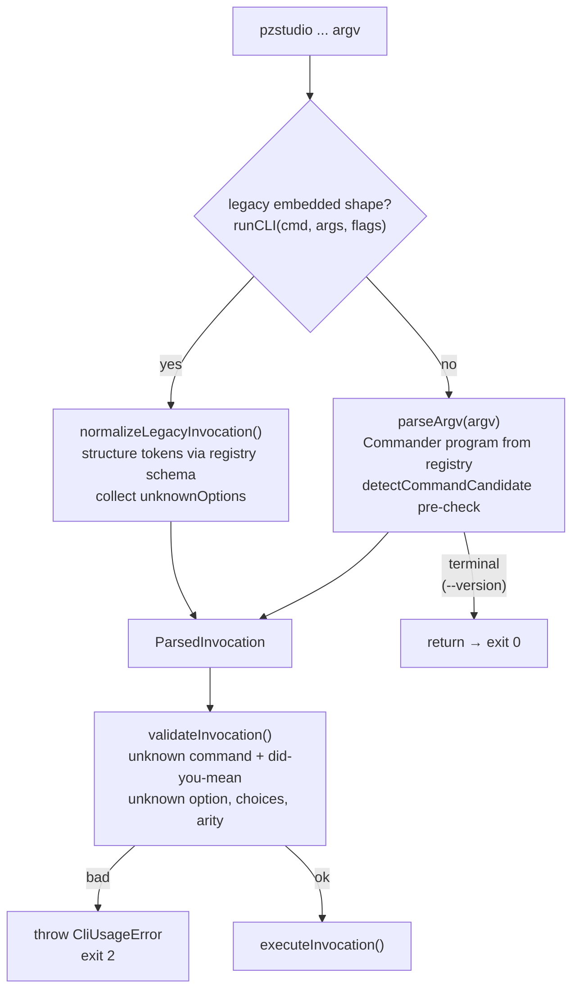
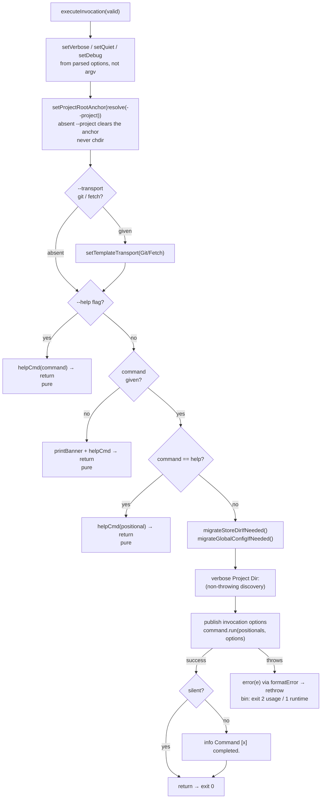
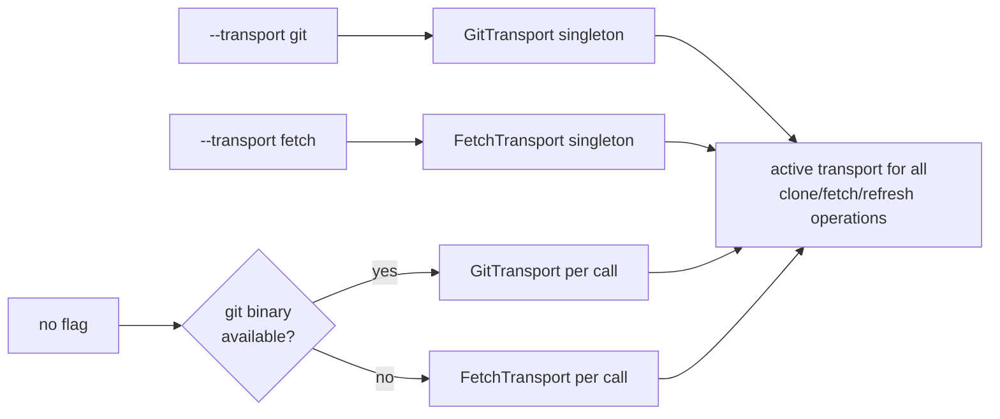
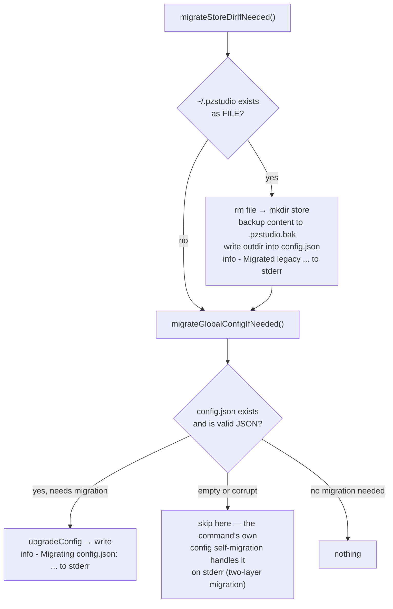

# 01 — Root Entry and Global Lifecycle

## Invocation paths (CLI-1)

Two hosts, one contract. The executable parses user argv; the embedded API converts its
pre-split shape. Both converge on the same `ParsedInvocation` → `validateInvocation()` →
`executeInvocation()` pipeline, so an invocation an embedder can build is one the
executable would also accept.



The pre-parse check (`packages/cli/src/lib/parser.ts:260-303`) is needed because the root
action handler would make Commander misreport an unknown command as *too many arguments*;
the scan is value-aware (a value-flag's value is never taken as the command) and covers
short value flags (`-C dir`).

Usage errors print their message only (no stack, no hint — Commander has already printed
its own detail for parse-level failures) and exit **2**
(`packages/cli/src/lib/parser.ts:77-85`).

## Execute phase



(`packages/cli/src/lib/cli.ts:126-197`.)

## Pure invocations (CLI-1)

`--help`, `--version`, no command, and `pzstudio help <cmd>` return **before**
`migrateStoreDirIfNeeded()`, global-config migration/creation, project discovery and any
network access. Pinned black-box: these invocations exit 0 and never create `~/.pzstudio`
(`tests/real-env/bin-contract-gate.test.ts:61-83`).

| Invocation | Output (stdout) | Side effects |
|---|---|---|
| `pzstudio --version` | `v<version>` | none |
| `pzstudio` (no command) | banner + command listing | none |
| `pzstudio --help` / `pzstudio help` | `Available commands:` listing (hidden commands filtered) | none |
| `pzstudio help <cmd>` | that command's curated help text | none |
| `pzstudio <cmd> --help` | same as `pzstudio help <cmd>` | none |

`pzstudio help <unknown>` is a usage error: `helpCmd` throws a `CliUsageError` —
`Unknown command [x]. Did you mean one of: ...?` — rendered message-only and mapped to
exit 2 (the same classification and suggestion shape as the parser's unknown-command
path).

## Transport selection

`--transport git|fetch` (validated choices) sets the module-level transport singleton in
the execute phase. Without the flag, every template operation resolves the transport at
call time: `getTemplateTransport()` returns `GitTransport` when the git binary is
available, else `FetchTransport` (`packages/cli/src/lib/transport.ts:425-430`).



The transport selection is **not** part of the pure-invocation fast path — it only matters
for commands that resolve templates. An invalid value never reaches selection:
`validateInvocation` rejects it with exit 2
(`Invalid --transport value 'x' (expected one of: git, fetch).`).

## Banner output (no command)

```
(blank line)
Project Zomboid Studio v0.42200.0 - @42.20.0-dev (2026-10-01T...)
(blank line)
Available commands:
    add            - Add a mod to your project.
    ...
```

Printed by `printBanner()` (`packages/cli/src/lib/cli.ts:199-212`) + `helpCmd()`.
Build date comes from `dist/build.json` (written during `pnpm build`); missing → `Unknown`.
Pinned by `tests/real-env/bin-index.test.ts` and the contract gate.

## Store migrations for real commands

Only non-pure invocations run the two legacy migrations. They are silent when there is
nothing to migrate.



**Two-layer migration** (CLI-2 discovery): the root lifecycle migrates *valid* JSON;
an *empty or corrupt* config is skipped at the root and migrated by the running
command itself. Both layers report through `info()` → **stderr** — stdout stays
reserved for command data, which is what makes `--json` output safe to
`JSON.parse` unconditionally (see `09-machine-interface.md`).

## Verbose diagnostics before dispatch

For real commands, before the handler runs:

```
[DEBUG] Project Dir:  <findProjectDir() ?? discoveryStartDir()>
[DEBUG] Executing command [list] with params [...]
```

`Project Dir:` uses **non-throwing** discovery so `new`/`migrate` (which legitimately run
outside a project) never fail on a diagnostic line
(`packages/cli/src/lib/cli.ts:178-183`).

## Exit behavior recap

`runCLI` never exits the host process — it logs the error (via `formatError`) and rethrows.
Only `src/index.ts` maps the rejection to an exit code (`CliUsageError` → 2, else 1);
embedded hosts receive a rejected promise. No process-level SIGINT handler is installed
here (CLI-6): `watch` owns its interruption; everything else keeps Node's default
signal termination.
