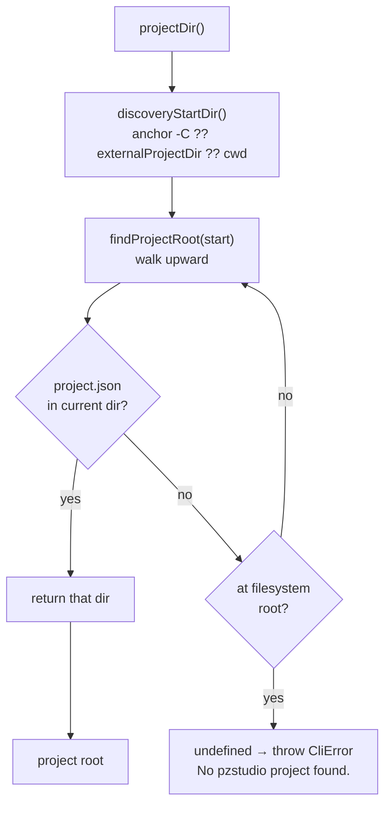
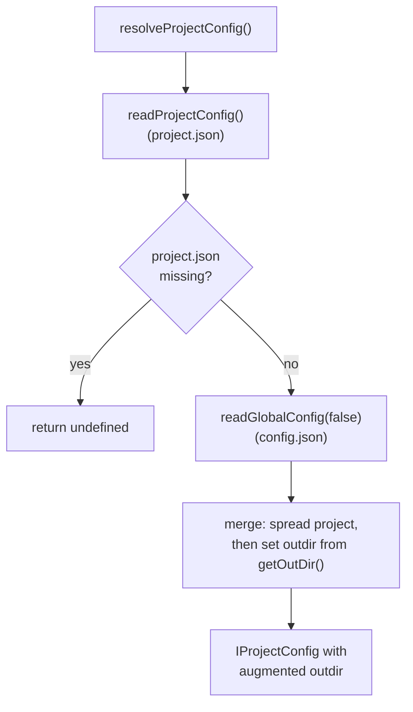
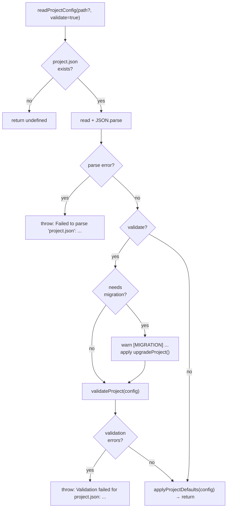
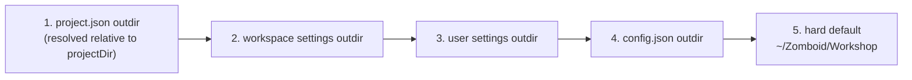

# 02 — Project Discovery and Config Resolution

## Discovery is fail-closed (CLI-5)

Every project-aware command resolves the project root through one discovery pipeline.
Discovery **never pretends** a directory is a project: when no `project.json` is found at
or above the start directory, `findProjectRoot` returns `undefined`
(`packages/cli/src/lib/helper.ts:217-230`) and `projectDir()` throws the shared
structured error.



The error carries a Cause/Try block (`packages/cli/src/lib/helper.ts:249-259`):

```
Problem: No pzstudio project found.
Cause: Searched from '<start>' up to the filesystem root for a project.json.
Try: Run 'pzstudio new <title>' to create a project, or point at one with 'pzstudio -C <dir> <command>'.
```

Pinned black-box in `tests/real-env/bin-discovery.test.ts` (message + `Searched from`
+ hint) and `tests/real-env/bin-contract-gate.test.ts` (`-C` to an empty dir → exit 1).

## Discovery start directory

`discoveryStartDir()` (`packages/cli/src/lib/helper.ts:206-208`) picks the first of:

1. the **`-C/--project <dir>` anchor** — set from the parsed invocation
   (`resolve()`, never a chdir; an invocation without `--project` **clears** the anchor,
   `packages/cli/src/lib/cli.ts:139-143`);
2. the **external anchor** (`setProjectDir(dir)`) — the embedded-host anchor
   (VS Code extension);
3. **`process.cwd()`**.

**The anchor also goes through discovery.** This is a deliberate change from the old
behavior: even an anchored directory is searched (upward) for a `project.json`. An anchor
that points at a sub-directory of a project resolves to the project root; an anchor that
points at a directory with no project fails closed instead of being used as-is. The same
rule applies to the external anchor — embedded hosts must anchor at (or inside) a real
project.

Non-throwing variants for commands that legitimately run outside a project:

| Helper | Behavior | Used by |
|---|---|---|
| `findProjectDir()` | discovery start → project dir or `undefined`, never throws | `new` (inside-project guard), `migrate`, the verbose `Project Dir:` line |
| `projectDir()` | same, but throws the structured CliError when `undefined` | the nine project-guarded commands |
| `discoveryStartDir()` | raw start dir (anchor/external/cwd), no search | `new` default destination |

## Who requires a project

- **Guard + throw (9 commands)** — `add`, `build`, `clean`, `delete`, `list`,
  `modconfig`, `modinfo`, `rename`, `watch`: all throw `CliError('No pzstudio project found.')`
  (e.g. `packages/cli/src/lib/commands/clean.ts:28-30`). On the embedded path the guard
  also protects against a stale anchor producing the old *wrong-directory* behavior.
- **`new`** — default destination is `discoveryStartDir()` (so `-C <dir> new Foo` creates
  in `<dir>`); the inside-project guard applies only when no `--path` was given and uses
  non-throwing discovery (`packages/cli/src/lib/commands/new.ts:50-69`).
- **`migrate`** — non-throwing: outside a project it still migrates the global config and
  logs `- No project.json found.` (`packages/cli/src/lib/commands/migrate.ts:156`).
- **`doctor`** — calls `projectDir()` up front: outside a project the structured error
  fires before the engine runs (`packages/cli/src/lib/commands/doctor.ts:38`).
- **`outdir`** — never resolves a project; writes the global config only.

## Config resolution hierarchy

`resolveProjectConfig()` merges the project file with global config defaults:



`readProjectConfig()` also applies migration and validation
(`packages/cli/src/lib/helper.ts:268-310`):



> **Corrupt ≠ missing**: an empty/corrupt `project.json` throws (JSON.parse or schema
> failure); an absent file returns `undefined` (→ the caller reports
> `No pzstudio project found.`).

## Outdir resolution chain

`getOutDir(project?, config?)` resolves the absolute output path
(`packages/cli/src/lib/helper.ts:453-479`); each step applies only when the previous
yielded nothing:



The legacy `.pzstudio.bak` outdir is consulted inside the global-config read/migration
layer (via the CLI's `migrationHostOptions()`, `packages/cli/src/lib/helper.ts:41-54`),
not as a separate step here.

## Embedding and anchors

- `setProjectDir(dir)` (`packages/cli/src/lib/helper.ts:180-182`) sets the **external
  anchor** — global mutable state that persists until changed. `createDevSync` sets it
  and leaves it set; the doctor gatherer restores the previous value in a `finally`.
- The `-C` anchor is **per-invocation**: `executeInvocation` sets it from
  `options.project` and clears it when the invocation carries no `--project`, so
  embedded re-invocations cannot inherit a stale `-C`.
- `setVsCodeSettings(workspace?, user?)` injects VS Code settings into the config
  resolution chain (workspace above user, both above config.json).

## Mod entry lookup

Mods are stored as `projectConfig.mods[modId]` in `project.json`. The `excludes` array is
a separate top-level list, not embedded in each mod entry.

To check if a mod is included (not excluded and not dev-only):
- `excludes.includes(modId)` → excluded
- `mods[modId].build?.devOnly === true` → dev-only
- otherwise → included (default)

`list` shows all 4 states: `on disk, included` / `on disk, dev builds only` / `on disk,
excluded from workshop build` / `missing on disk` (see `05-mod-state-machine.md`).
