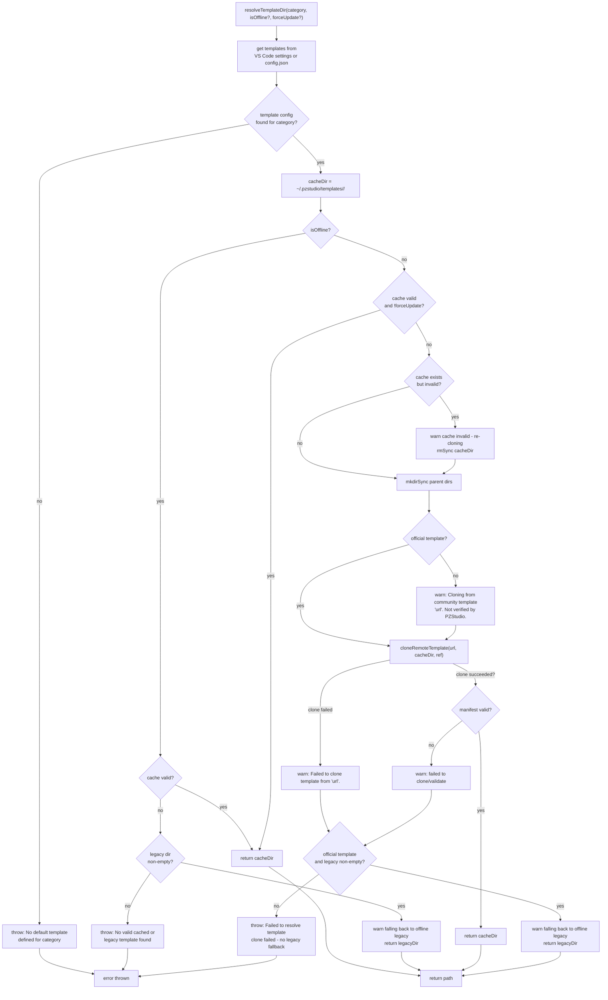
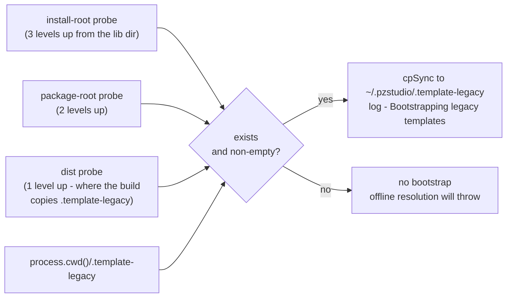

# 03 — Template Resolution and Transport

## resolveTemplateDir() decision tree



## Official-only legacy fallback

The offline legacy fallback after a failed clone/download is **restricted to official
templates** (`packages/cli/src/lib/templateManager.ts:146-172,553-557`):

- `isOfficialTemplate(url)` is true when the URL points at the `escapepz` GitHub org
  (all built-in defaults do — `packages/core/src/constants.ts:25-33`) or is a bare name
  without a `/`.
- A **community template URL gets no legacy fallback**: when its clone/refresh fails the
  error is thrown for real. This keeps `update` failures honest and deterministic — the
  contract-gate suite pins `update` with a community URL pointing at the reserved
  `.invalid` TLD: all 4 categories fail → `Refreshed 0/4 template caches` → exit 1,
  independent of network state (`tests/real-env/bin-contract-gate.test.ts:278-300`).
- The offline path (`--offline`) still consults the legacy dir for any category, because
  the legacy templates are bundled with the binary rather than resolved from the URL.

## Template transport

Selection: `--transport git|fetch` (validated choices) sets the module-level singleton;
otherwise every template operation resolves the default at call time — `GitTransport`
when the git binary is available, else `FetchTransport`
(`packages/cli/src/lib/transport.ts:425-430`).

### GitTransport (default)
- **download**: `git clone --depth 1 --recurse-submodules --shallow-submodules [-b ref] <url> <dest>`
  (spawn without shell, 120s timeout, stderr surfaced into the error message).
- **refresh**: `git fetch --all --tags` → `git reset --hard <target>` (tries `origin/<ref>`,
  then `refs/tags/<ref>`, then bare `<ref>` — branch vs tag refs both supported) →
  `git submodule update --init --recursive --force` → `git clean -fdx`.
- **cache valid**: directory non-empty **and** contains `.git`.

### FetchTransport (no git required; future web default)
- **download**: codeload archive `https://codeload.github.com/<owner>/<repo>/zip/HEAD`
  (no ref) or `/zip/refs/heads/<ref>` then `/zip/refs/tags/<ref>` (branch first, tag second —
  codeload 404s the wrong kind). The HTTPS download runs in a short-lived child process
  (the CLI is synchronous and Node has no sync fetch), the zip is extracted with `fflate`,
  the GitHub top-level `<repo>-<sha>/` folder is stripped, and a zip-slip guard rejects
  entries escaping the destination. A `.pzstudio-fetch.json` manifest (url + fetchedAt)
  is written for later refreshes.
- **refresh**: read the manifest url → delete the cache dir → re-download. No manifest
  → warning, cannot refresh (delete to force).
- **cache valid**: directory non-empty (no `.git` required).

### URL / ref validation (both transports)
- `user/repo` shorthand, `user/repo@tag`, `user/repo#branch`, or full `https://github.com/...`
  URLs — only github.com repositories are accepted.
- ref charset: letters, digits, `.`, `_`, `-`, `/` (or the literal `default`).
- Violations throw `TemplateResolutionError` / `TemplateCloneError` with the offending value.

## Bootstrap chain for bundled templates

When no cached or remote templates are available (first run, no network), the CLI falls
back to `.template-legacy/` bundled with the binary. The first time a legacy template is
needed, `bootstrapLegacyTemplates()` (`packages/cli/src/lib/templateManager.ts:208-242`)
probes candidate locations relative to the compiled install layout and the working
directory, and copies the first non-empty hit to `~/.pzstudio/.template-legacy`:



The `.template-legacy` submodule lives at the repo root. During development it is cloned;
in published packages it is populated into `dist/` by the build script. Resolution reads
`~/.pzstudio/.template-legacy/.template-<category>` afterwards.

<!-- VERIFY: the probe-intent comment in templateManager.ts:214-217 says the first probe
     covers the repo root during development, but from the compiled lib directory 3 levels
     up lands at packages/ (repo root would be 4 levels up). In practice the dist copy
     (1 level up, where the build script populates it) and the cwd probe are what hit.
     Docs describe the probes abstractly; consider fixing the code comment or the probe
     list in a later commit. -->

## Scaffold operations

### scaffoldProject (copy or junction)
```
if useSymlinks && asJunction:
    symlinkSync(template, dest, 'junction')  → fallback on failure
cpSync(template, dest, {
    filter: createIgnoreFilter(template, options)
})
```

### scaffoldTemplateFolder (.template-mod, .template-language, .libraries)
```
if useSymlinks:
    symlinkSync(template, dest, 'junction')  → fallback on failure
scaffoldProject(template, dest, false, false)  ← always copies
```

## Ignore filter rules (in priority order)

1. **Hardcoded always-exclude**: `.git`, `.github`, `.gitmodules`, `.gitkeep`
2. **Optional dotfiles**: when `ignoreDotFiles: true` — all dot-prefixed files except `.pzstudioignore`
3. **Closest-ancestor .pzstudioignore rule wins**: walk up from the file to sourceRoot, apply the
   first matching rule found
4. **.pzstudioignore itself**: included unless `excludeIgnoreFile: true`

## Template category usage

| Category | Used by | Description |
|---|---|---|
| `project` | `new` | Full project structure (project.json, workshop/, mod folders) |
| `mod` | `new`, `add` | Mod template (media/, scripts/, mod.info) |
| `workshop` | `new`, `build`, `watch` | workshop/ folder (description.txt, preview.png, scripts/) |
| `language` | `new` | `.template-language` shared folder |

In `new`, if `.template-mod` or `.template-workshop` exists in the working directory with
content, it is used as a local override instead of the cached template (the
local-templates tier-0 guard in `new`; `add` seeds and reuses the project's own
`.template-mod`).
