# 04 — Command Flows

Command metadata below is generated from the registry
(`packages/cli/src/lib/registry.ts`) — flags/positionals declared there are what the
parser enforces on both hosts. `*` marks a required positional; the global flags
(`--verbose`, `--quiet`, `--debug`, `--transport`, `-C/--project`, `--help`) are always
available and are not repeated per command.

| Command | Positionals | Flags | Silent | Hidden |
|---|---|---|---|---|
| `add` | `modName*` `[modId]` | `--offline` `--force-update` | | |
| `build` | — | `--production` `--development` `--both` | ✔ | |
| `clean` | — | — | ✔ | |
| `delete` | `modId*` | `--yes` `--dry-run` | | |
| `doctor` | — | `--game-build <v>` `--json` | | |
| `help` | `[command]` | — | ✔ | |
| `lang` | `modId*` `lang*` `[toLang]` | — | | ✔ |
| `list` | — | `--json` | | |
| `migrate` | — | — | | |
| `modconfig` | `modId*` `[action...]` | — | | |
| `modinfo` | `action*` `[modId]` | `--force` | ✔ | |
| `new` | `title*` `[modId]` | `--path <dir>` `--offline` `--force-update` `--symlinks` | | |
| `outdir` | `path*` | — | | |
| `rename` | `oldModId*` `newModId*` | `--yes` `--dry-run` | | |
| `update` | — | — | | |
| `watch` | — | `--production` `--development` `--both` | ✔ | |

Every project-aware command starts with the same fail-closed discovery gate
(`No pzstudio project found.` — see `02-project-resolution.md`). Template-consuming
commands additionally resolve their template first (see `03-template-resolution.md`).

Legend used in the diagrams:

- `ERR` (red) — the command aborts with a thrown error; the bin layer turns it into
  exit 1 (or 2 for `CliUsageError`).
- `WARN` (orange) — the command continues; a warning is printed to stderr.
- Rounded/gray — successful exit of the command.

Stream routing (CLI-2, pinned since 0.42200.1): human **progress** lines
(`Building main workshop...`, `Cleaning ... directory...`, `Deleting mod ...`,
`Renaming mod ...`, `Refreshing/Updating templates...`, scaffold/clone steps)
print to **stderr**. `LOG`/`stdout:` labels mark **data and results** (reports,
verdicts, dry-run `Would:` plans, the `Next:` block, JSON envelopes) which stay
on stdout. Since 0.42200.1 `build` prints nothing on stdout at all, and the
`[INFO]`/timestamp/color prefixes are presentation, not stable API.

---

## pzstudio new

`new` is a **transaction** (CLI-4): everything is scaffolded into a staging directory and
committed with a single atomic rename — the destination never exists in a partial state.

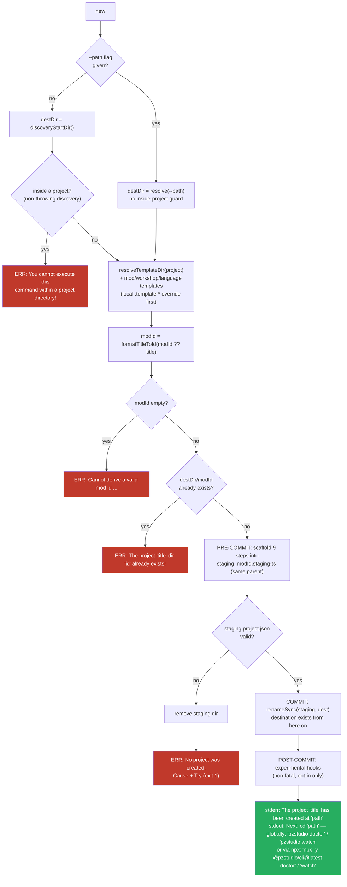

Key behaviors:

- **Fail before commit → nothing is left behind**: the staging dir is removed and
  `CliError('No project was created.', {cause, tryHint})` is thrown
  (`packages/cli/src/lib/commands/new.ts:203-216`). Pinned black-box: no destination
  debris, no `.staging-` leftovers (`tests/real-env/bin-contract-gate.test.ts:256-274`).
- Failures during validation/preflight (before staging exists) keep their original
  messages and are not wrapped.
- **Golden path** (CLI-7): on success stdout ends with a `Next:` block telling
  the user to `cd '<path>'`, then `pzstudio doctor` + `pzstudio watch` when the
  package is installed globally, or the `npx -y @pzstudio/cli@latest`
  equivalents on the zero-install path
  (`packages/cli/src/lib/commands/new.ts:227-241`).
- The success message itself (`The project '...' has been created at '...'`) is `info`
  → stderr.

---

## pzstudio add

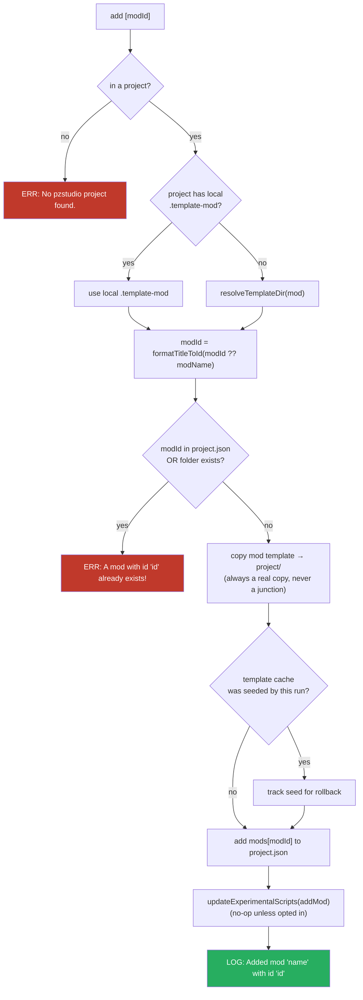

**Ownership rollback guard** (CLI-4): `createdPaths` tracks only what *this invocation*
created (the mod dir; the seeded `.template-mod` only when the cache did not exist
before). On failure the tracked paths are rolled back newest-first and the original error
is rethrown. A pre-existing mod directory is never deleted. The mod template is always
copied (junctions are intentionally not used — the mod folder must diverge from its
template).

---

## pzstudio build

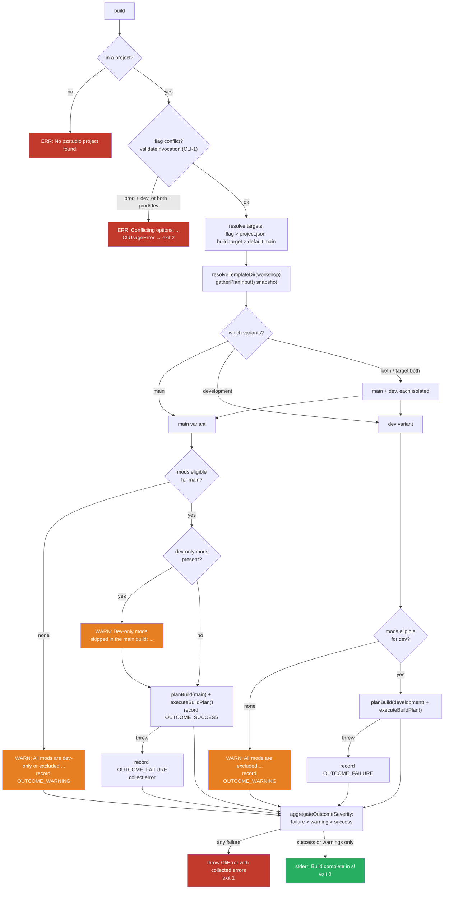

Exit semantics are mechanical, not prose (CLI-6,
`packages/cli/src/lib/commands/build.ts:143-210` + `packages/cli/src/lib/outcome.ts`):
a failed variant no longer aborts the other one under `--both` — every variant gets its
chance, then any `failure` outcome fails the command via a structured `CliError` (the old
`Unexpected error:` wrapper is gone). Warnings never flip the exit code.
Build progress (`Building main workshop...`, plan plan-messages, the `Build complete`
timing) prints to stderr — stdout stays empty on a successful build (CLI-2).

The workshop template resolution can touch the network (clone) when the cache is missing
or invalid — see `08-mechanics.md` → Template resolution during build/watch.

---

## pzstudio watch

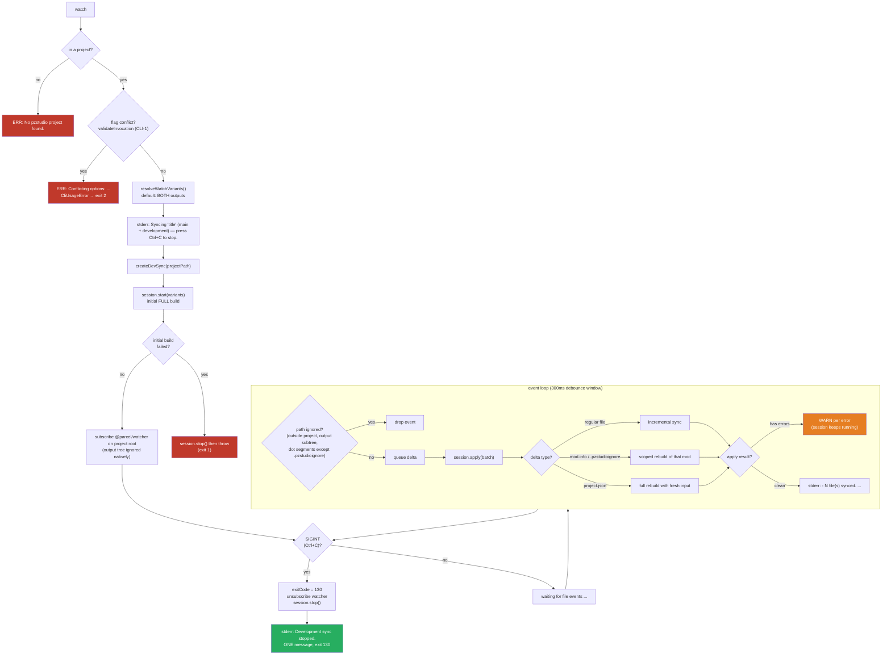

Special rules:

- The banner is a **single line** (CLI-7):
  `Syncing '<title>' (main + development) — press Ctrl+C to stop.`
  (`packages/cli/src/lib/commands/watch.ts:68-71`).
- **watch owns SIGINT** (CLI-6): one `process.once('SIGINT')` sets `exitCode = 130`,
  unsubscribes, stops the session and prints `Development sync stopped.` exactly once —
  there is no global handler double-reporting anymore
  (`packages/cli/src/lib/commands/watch.ts:169-178`). Pinned on POSIX:
  `tests/real-env/bin-watch.test.ts` + `bin-contract-gate.test.ts` (skipped on Windows,
  which cannot reliably deliver SIGINT to a child).
- A source file that vanishes before the batch runs (atomic-save temp files) is silently
  skipped; directory events pass through as create/delete; RENAME arrives as delete+create.
- Unlike `build`, the default target is **both** outputs (dev_branch needs to stay live).
- `@parcel/watcher` is required lazily inside the command (native binding must not load
  through the embedded api import path).

---

## pzstudio clean

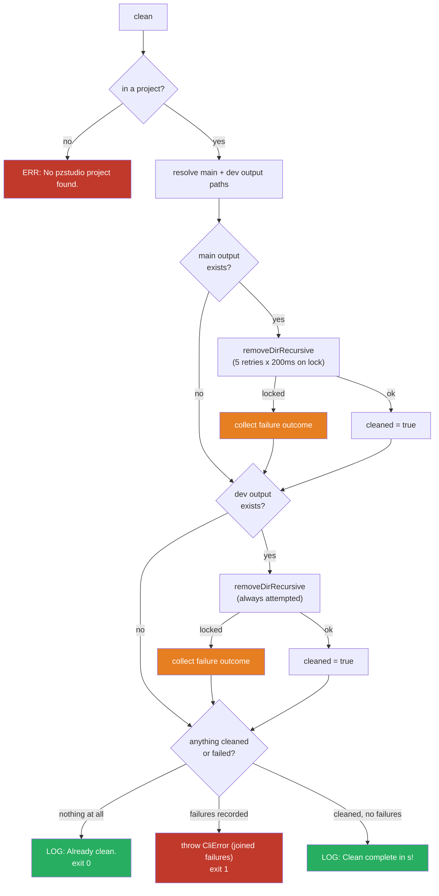

**Nothing to clean is success, not failure** (CLI-6): `Already clean.` with exit 0
replaced the old error path. Both outputs are always attempted — a locked main output
does not skip the dev output cleanup; failures are collected and thrown together
(`packages/cli/src/lib/commands/clean.ts:42-78`).

---

## pzstudio delete

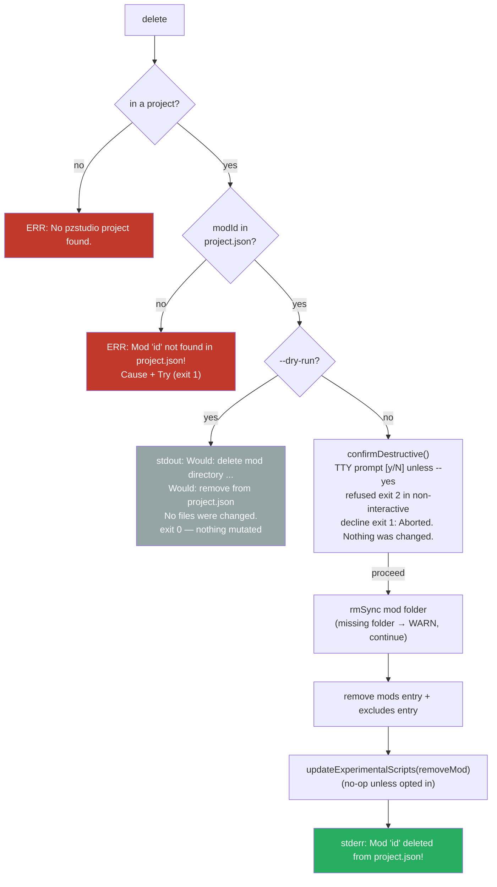

Ordering matters (CLI-9, `packages/cli/src/lib/commands/delete.ts:51-66`):
validation failures keep exit 1; `--dry-run` wins over `--yes` and runs **before** the
gate; the consent gate is the last step before the first mutation.
See `08-mechanics.md` → Destructive consent gate for the full policy.

---

## pzstudio rename

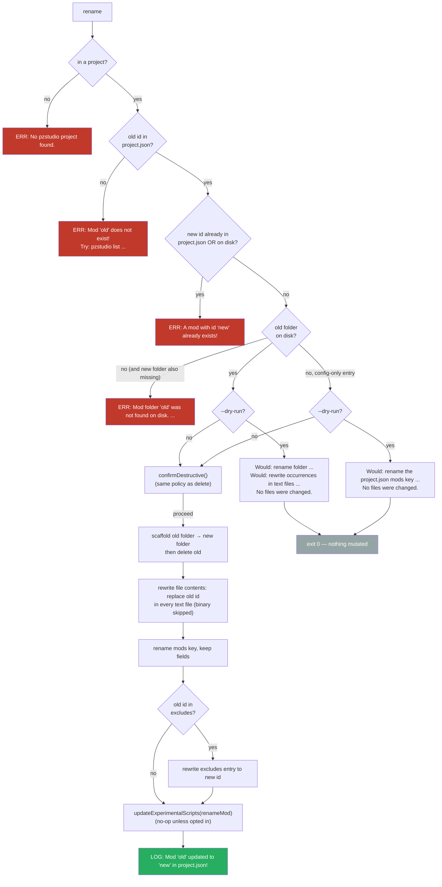

Only the **id** changes (folder + project.json key + occurrences inside files);
the mod's `name` field is untouched, and an excluded mod stays excluded under its new id.
Binary extensions are skipped to avoid corruption. A config-only entry (no folder on
disk) can be renamed: only the project.json key moves
(`packages/cli/src/lib/commands/rename.ts:60-131`).

---

## pzstudio modinfo generate

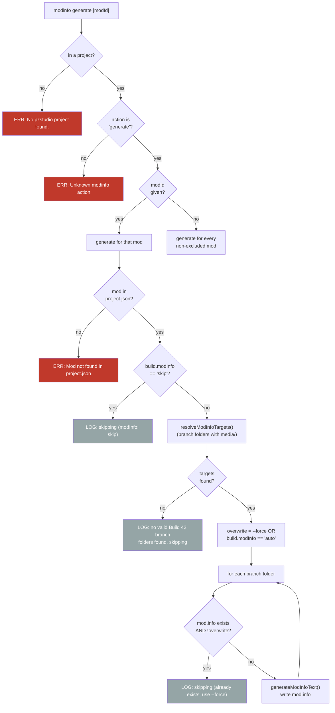

Root-level mod.info is NOT a target — only branch folders (e.g. `42/`, `common/`) that
contain a `media/` directory qualify (Build 42 layout).

---

## pzstudio modconfig

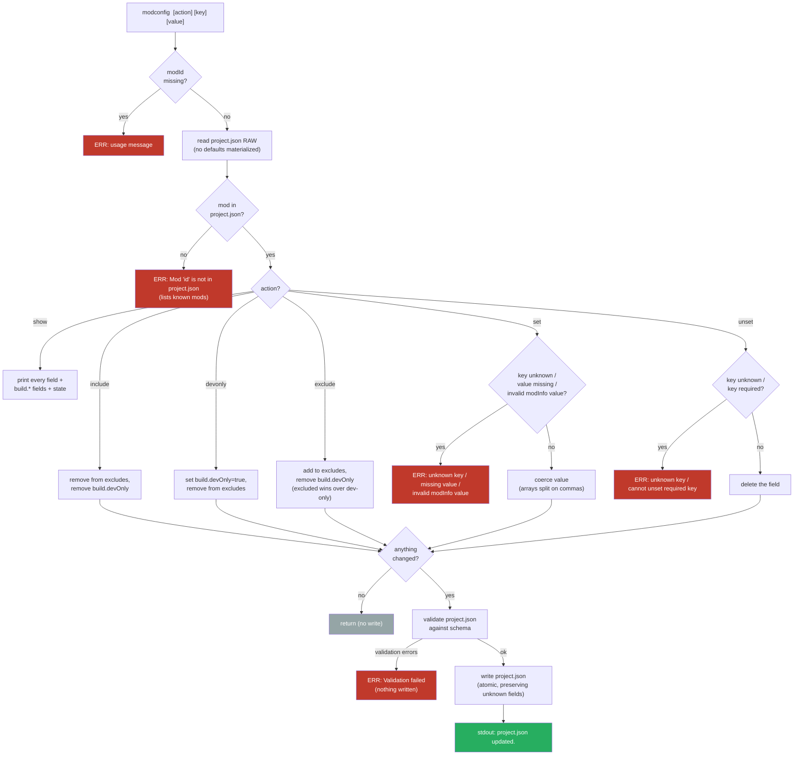

No-op edits (already in the requested state) print "was already ..." and skip the write
entirely. Validation happens **after** the edit and **before** the write — an invalid
result never lands on disk.

---

## pzstudio list

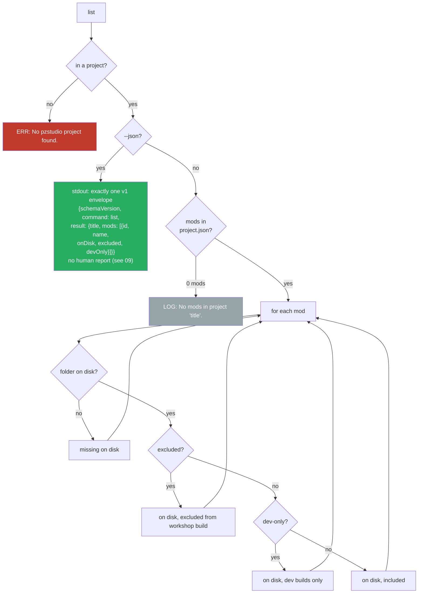

Read-only command in both modes — `--json` never writes and never prints the human
report (`packages/cli/src/lib/commands/list.ts:36-54`; envelope contract in
`09-machine-interface.md`).

---

## pzstudio outdir

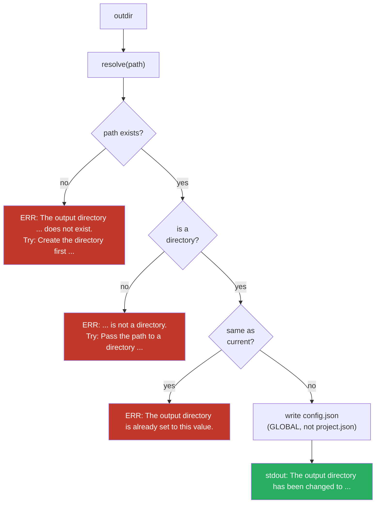

The first two failures throw structured `CliError`s with Try hints
(`packages/cli/src/lib/commands/outdir.ts:28-46`); the third is still a plain error
(rendered through the unexpected-error wrapper). ⚠️ Writes the **global** config.json —
this affects every project on the machine that does not set its own `outdir`.

---

## pzstudio doctor

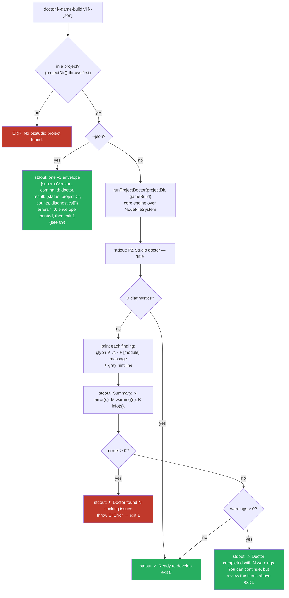

The verdict is result-based (CLI-7, `packages/cli/src/lib/commands/doctor.ts:78-115`):
zero diagnostics and warnings-only both end in a verdict line on stdout with exit 0;
only errors exit 1 (the thrown message is
`Doctor found N blocking issues. See the report above.`).

Checks performed by the engine (severity in parentheses):
- **project**: missing project.json (single `project.missing` finding); parse/version/validation
  failures; description.txt missing (warning); preview.png missing (info)
- **environment**: capability-based (web hosts get info-level notes)
- **filesystem**: outDir missing (info — created by build); not a directory (error); inside the
  project folder (warning)
- **templates**: cache not populated (info)
- **mods**: included mod folder missing (error); excluded mod folder missing (warning); no branch
  folder (error); modInfo=skip with no mod.info anywhere (warning); devOnly + excluded (warning);
  orphan excludes entries (warning); zero mods (info)
- **buildTarget**: no production output possible (info); no development output possible (info);
  pzBuildCompatibility mismatch with `--game-build` (warning, never blocks)

---

## pzstudio migrate

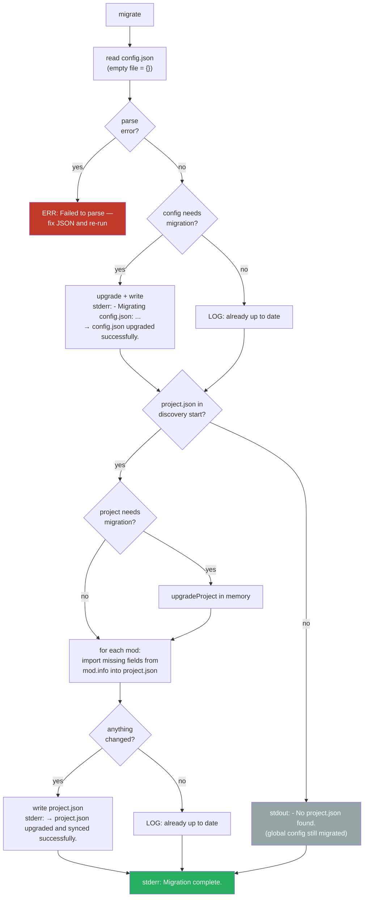

`migrate` works outside a project (CLI-5): discovery is non-throwing, and the no-project
message is the neutral `- No project.json found.`
(`packages/cli/src/lib/commands/migrate.ts:156`). Unknown fields are preserved.

---

## pzstudio update

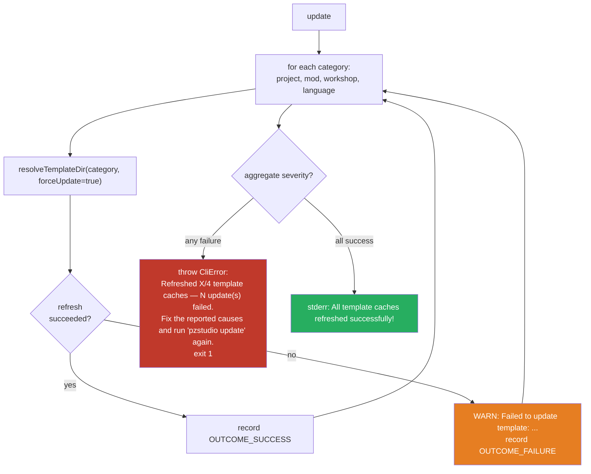

**Partial failure is a failure** (CLI-6, `packages/cli/src/lib/commands/update.ts:39-58`):
every category is still attempted, but the command exits 1 when any refresh failed —
the summary message doubles as the retry instruction. Community template URLs get no
legacy fallback, so their failures are real failures (see `03-template-resolution.md`).

---

## pzstudio lang

`lang` is registered with `hidden: true` (CLI-7): the old route still runs and
`pzstudio help lang` prints its curated text, but it no longer appears in the generated
command listing (did-you-mean may still suggest it — only the help listing is contract).

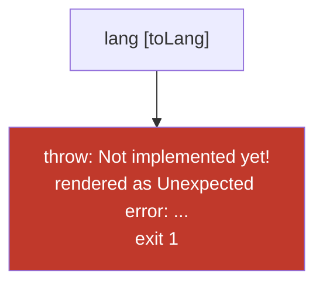

---

## pzstudio help [<command>]

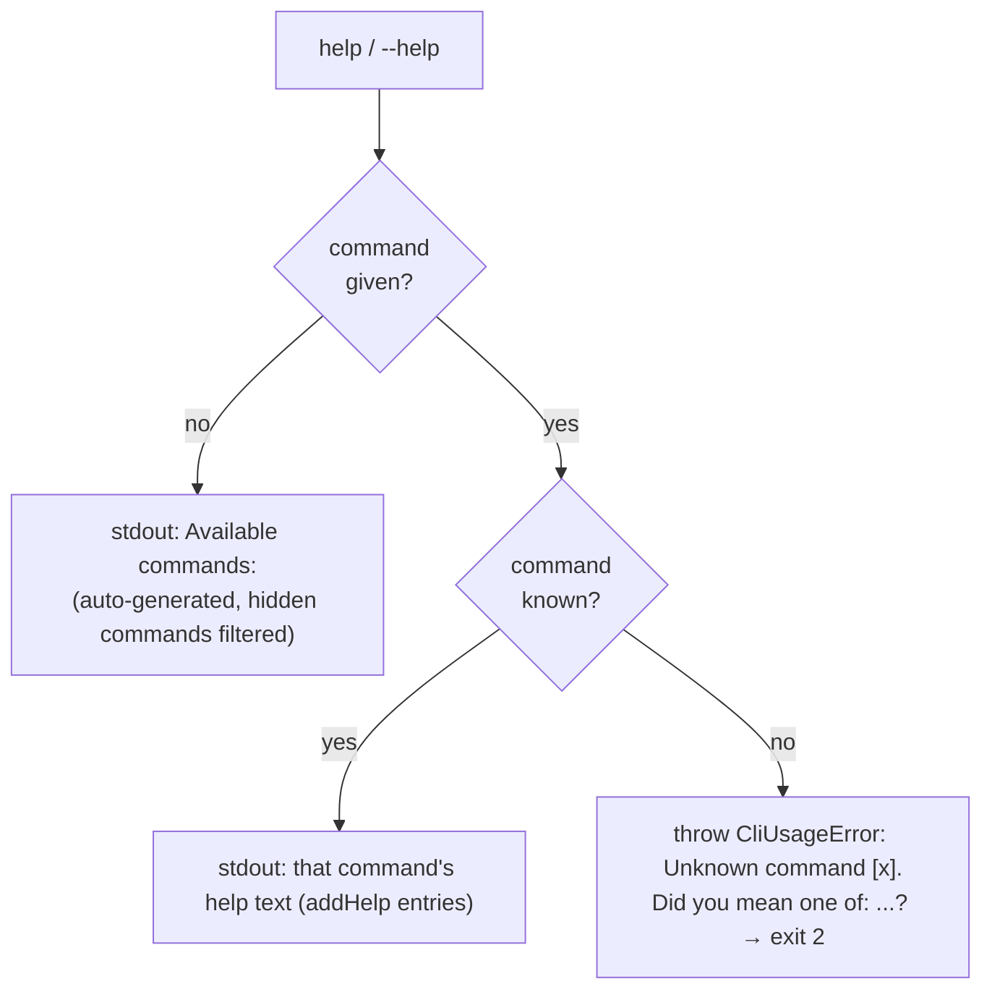

`--help` is a pure invocation everywhere: it short-circuits positional arity validation
and never runs migrations or discovery (`packages/cli/src/lib/cli.ts:152-169`).
