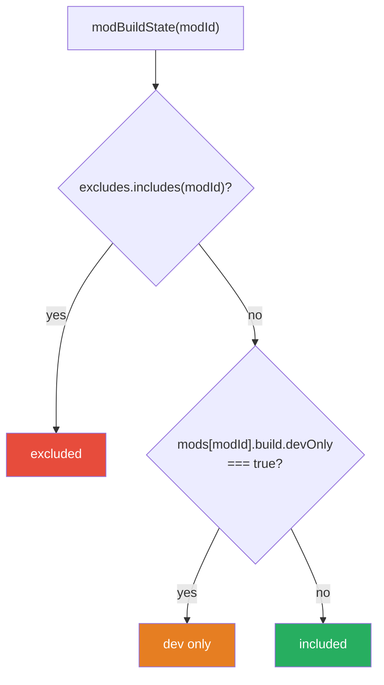
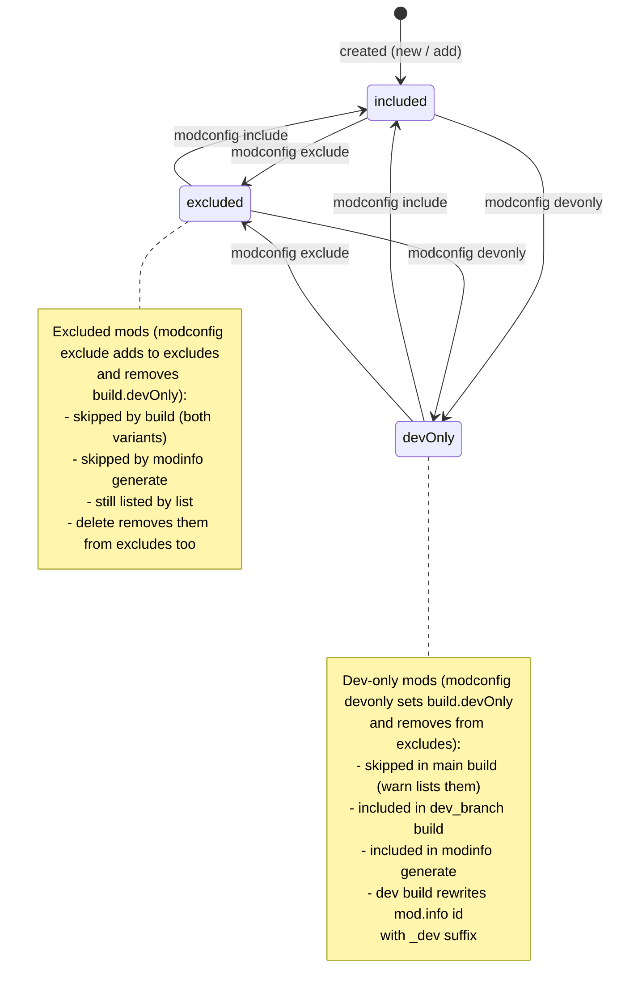

# 05 — Mod Build State Machine

Every mod in a project has exactly one of three build states, derived from two independent
pieces of state in project.json:

- `excludes: string[]` — top-level array of mod ids
- `mods[modId].build.devOnly: boolean` — per-mod flag

## State derivation (precedence order)



`excluded` wins over `dev only` — the invariant is enforced by `modconfig` when switching states.
`list` follows the same precedence for its display status, and `list --json` exposes the raw
booleans with that precedence already applied: `excluded` as read from the array,
`devOnly` computed as `!excluded && build.devOnly === true`
(`packages/cli/src/lib/commands/list.ts:39-50`).

## State transitions via `modconfig`



## Effect of each state on commands

| Command | included | dev only | excluded |
|---|---|---|---|
| `build` (main) | built | skipped + warning | skipped |
| `build` (development) | built (id + `_dev` suffix in mod.info) | built (id + `_dev`) | skipped |
| `watch` | synced to both outputs | main-output files never produced | ignored |
| `modinfo generate` | generated | generated | skipped |
| `list` | "on disk, included" | "on disk, dev builds only" | "on disk, excluded from workshop build" |
| `clean` | output removed (state irrelevant) | output removed | output never existed |
| `doctor` | folder missing = error | folder missing = error | folder missing = warning |
| `delete` | folder + config removed | folder + config removed | folder + config + excludes entry removed |

## Variant eligibility

```
collectIncludedModIds(config, 'main'):
    mods where NOT excluded AND NOT devOnly

collectIncludedModIds(config, 'development'):
    mods where NOT excluded   (devOnly included)
```

A variant with zero eligible mods is skipped with a warning — the previous output on disk is
never touched (empty-folder bug fixed in `665794a`).

## Fourth display state: missing on disk

`list` and the explorer also recognize a mod whose entry exists in project.json but whose folder
is gone (deleted by hand, bad git checkout). This is not a build state — it is orthogonal:

- `list`: "missing on disk"
- `doctor`: error when included, warning when excluded
- `rename`: refuses (folder required for content rewrite)
- `delete`: warns and continues (removes config entry)
