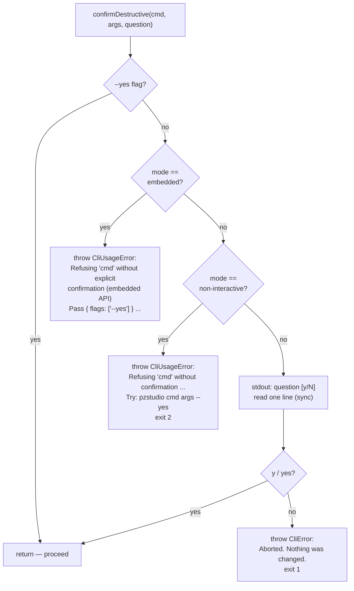
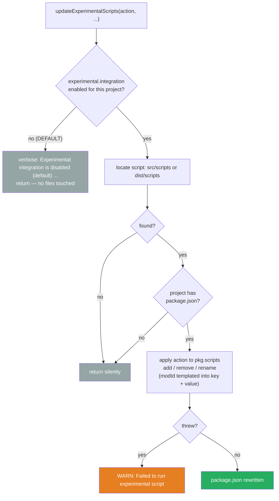

# 08 — Cross-cutting Mechanics

Behavior shared by every command: argument parsing, the stream contract, the consent
gate, interrupt handling, the experimental opt-in hook, and the embedding API the VS
Code extension uses.

---

## Argument parsing (lib/parser.ts — Commander, schema-driven)

The parser is a thin Commander adapter built from the registry schema. It never calls
business logic and never exits the process. What it guarantees on **both** hosts
(executable argv and embedded `runCLI(cmd, args, {flags})`):

- **Global flags parse in every position** — `pzstudio --verbose build` and
  `pzstudio build --verbose` are equivalent (declared on the root program and repeated on
  every subcommand; values merged via `optsWithGlobals()`).
- **Valued flags never leak their value into positionals** (old quirk Q1, fixed CLI-1):
  `pzstudio add MyMod --transport fetch` adds mod `MyMod`; `fetch` is consumed as the
  flag value. The legacy path pairs values by the same registry schema
  (`normalizeLegacyInvocation`, `packages/cli/src/lib/parser.ts:352-408`).
- **A valued option is never mistaken for the command** (old quirk Q2 class, fixed):
  `pzstudio --transport fetch list` runs `list` — the pre-parse command-candidate scan is
  value-aware, including short flags (`-C dir` consumes `dir`; `-Cdir`/`-C=dir` are inline).
  Pinned: `tests/real-env/bin-contract-gate.test.ts:90-111`.
- **Unknown command / unknown flag → exit 2** with a did-you-mean suggestion for commands;
  excess positionals are also a usage error (previously silently ignored).
- **Positional arity is enforced by one shared validator** (`validateInvocation`) so both
  hosts behave identically; `--help` short-circuits arity on both paths.
- Positionals stay raw strings (mod ids like `12345` are never coerced to numbers).

The old `setProcessArgsOverride` / `cmd()` / `args()` / `splitArgs` machinery is gone;
`hasFlag`/`extractFlag` are now thin readers over the invocation options published by the
lifecycle right before dispatch (and cleared afterwards).

---

## Logging and output streams (lib/logger.ts — stream contract, CLI-2)

| Function | Stream | Format on TTY | Format when piped |
|---|---|---|---|
| `log` | **stdout** (data) | message as-is (no prefix/timestamp ever) | same |
| `info` | **stderr** (progress) | `[YYYY-MM-DD HH:MM:SS] [INFO] message` (cyan) | `[INFO] message` |
| `warn` | **stderr** | `[YYYY-MM-DD HH:MM:SS] [WARN] message` (yellow) | `[WARN] message` |
| `verbose` | **stderr** | `[YYYY-MM-DD HH:MM:SS] [DEBUG] message` (gray) | `[DEBUG] message` |
| `error` | **stderr** | `[YYYY-MM-DD HH:MM:SS] [ERROR] <formatError output>` (red) | `[ERROR] <formatError output>` |

- **stdout carries data, stderr carries progress/diagnostics** — a piped command's stdout
  contains only the result (report, envelope, verdict), never ANSI codes, timestamps or
  `Command [x] completed.` noise. Pinned black-box:
  `tests/real-env/bin-contract-gate.test.ts:136-146`.
- Timestamp and color are applied **only when the target stream is a TTY**; piped output
  is clean prefixed text (picocolors never injects escape codes here).
- `error()` renders through `formatError` (see `06-error-taxonomy.md`); no stack unless
  `--debug`.
- `--quiet` suppresses `info`/`verbose`; `warn`/`error` always print. `--debug` implies
  verbose.
- Everything funnels through the shared **CliIO** sink (`setCliIO()` test hook) — the same
  sink Commander writes usage/version output to, so parsers and handlers share one pipe
  per stream.
- `clear()` was **removed** (CLI-2): no `\u001b[2J` escape is written to stdout anymore,
  not even on a TTY.
- Hosts can replace the whole logger via `setLogger(ILogger)` (the extension bridges
  everything into its OutputChannel; the bridge path is unchanged by the stream contract).

### Migration reporting (all stderr)

All legacy store migrations report through `info()` → **stderr**: the root-lifecycle
migration of a *valid* config.json (`- Migrating config.json: ...`), the legacy
`.pzstudio` file migration (`- Migrated legacy .pzstudio file ...`), and the
*empty or corrupt* config path handled by the running command. stdout stays reserved
for command data, so `--json` consumers can `JSON.parse(stdout)` unconditionally
(see `09-machine-interface.md`).

---

## Destructive consent gate (lib/interaction.ts — CLI-9)

`confirmDestructive(command, args, question)` is the single gate for destructive
mutations (`delete`, `rename`); handlers call it before their first mutation and never
check the terminal themselves. The **InteractionMode** is decided once per `runCLI`
invocation from the invocation shape (`packages/cli/src/lib/cli.ts:78-84`):

| Mode | When | Destructive behavior without `--yes` |
|---|---|---|
| `interactive` | executable attached to a TTY | prompt `<question> [y/N] ` and read one line |
| `non-interactive` | executable without a TTY (pipes, CI) | refuse: `CliUsageError` → exit 2, message ends with the exact `Try: pzstudio <cmd> <args> --yes` |
| `embedded` | `runCLI(cmd, args, {flags})` library call | refuse: `CliUsageError` — embedded never prompts, but it also never proceeds silently; the host passes `{ flags: ['--yes'] }` after its own confirmation UI |

(`packages/cli/src/lib/interaction.ts:76-96`.)

Behavior details that are contract:

- The gate is **fully synchronous** — the TTY prompt reads stdin byte-at-a-time with
  `fs.readSync`, so `delete`/`rename` keep their sync signatures. Any stdin read failure
  or EOF degrades to an empty answer, which is treated as a decline (a destructive action
  never proceeds on an unreadable confirmation).
- The prompt goes to **stdout** through CliIO (it is input UX, not progress) — a deliberate
  one-line exception to the stream table above.
- `--dry-run` is handled **before** the gate and beats `--yes`: it prints the plan
  (`Would: ...` lines + `No files were changed.`) and returns without mutating, exit 0.
- Validation guards run **before** the gate: an unknown mod id still exits 1 with its
  normal error, not a refusal.
- Only `y`/`yes` (case-insensitive, trimmed) proceeds; anything else aborts with
  `Aborted. Nothing was changed.` (exit 1, nothing mutated).
- `setStdinReader()` is an `@internal` test hook replacing the stdin reader (used instead
  of spying on `fs.readSync`, which crashes Windows test workers).

Pinned black-box: refusal/yes/dry-run × delete/rename in `tests/real-env/bin-lifecycle.test.ts`;
an embedded smoke test renames and deletes through the api with explicit `--yes`
(packages/vscode-extension integration suite).

---

## Interrupt and exit semantics (CLI-6)

There is **no global SIGINT handler** in `runCLI` — a process-level handler would leak
into embedded hosts and double-report alongside the command's own handler.

- **`watch` owns its interruption**: `process.once('SIGINT')` sets `process.exitCode = 130`,
  unsubscribes the watcher, stops the session, and prints `Development sync stopped.`
  exactly once (`packages/cli/src/lib/commands/watch.ts:169-178`).
- **Every other command** is short and synchronous-ish: Ctrl+C falls through to Node's
  default signal termination (the shell still reports 130 by convention).

| Exit code | When |
|---|---|
| 0 | command completed — including warnings-only results and `clean` with nothing to clean |
| 1 | any thrown runtime error (bin entry maps the rejection); `doctor` with ≥ 1 error; `update` with any failed category |
| 2 | `CliUsageError` (see `06-error-taxonomy.md`) |
| 130 | SIGINT during `watch` (graceful, single message) |

---

## Experimental package scripts hook (CLI-10 — opt-in, BREAKING)

`updateExperimentalScripts(action, projectDir, modId?, newModId?)` runs after the
mutation in `new` (addProject+addMod), `add` (addMod), `delete` (removeMod),
`rename` (renameMod). Its first line is the opt-in gate:

(`packages/cli/src/lib/helper.ts:680-733`.)

What the built-in script injects **when opted in** (Windows-only, hardcoded machine
paths): junction-creation `mklink /J` entries into the project's `package.json` scripts
(`experimental:setup:vanilla` pointing at
`%ProgramFiles(x86)%\Steam\...\ProjectZomboid\media\lua`; per-mod
`experimental:setup:nonsteam:{modId}` pointing at `C:\ZomboidClient1`). Never fatal.
With the default (disabled), none of this happens — `new`/`add` no longer write
`experimental:*` scripts into the project's package.json. Pinned by
`tests/real-env/bin-new.test.ts` (default-off case + global opt-in case).

---

## Embedding API (api.ts) — the host contract

The VS Code extension bundles `@pzstudio/cli/api` in-process. Surface groups:

| Group | Exports |
|---|---|
| Entry | `runCLI(cmd?, args?, { flags })` — the only way to invoke commands |
| Interaction | implicit: embedded mode — never prompts; destructive commands require `--yes` (CLI-9) |
| Logger | `setLogger`, `ILogger`, direct `log`/`info`/`warn`/`verbose` for long-lived sessions |
| Host anchoring | `setProjectDir(dir)` (external anchor), `setVsCodeSettings(ws?, user?)` |
| Build planner | `planBuild`, `collectIncludedModIds`, `resolveBuildOutputPath`, `sanitizeFolderName`, `patchModInfoId`, types `FileOperation`/`PlanBuildInput`/`ModSourceState` |
| Mod info | `resolveModInfoTargets` |
| Diagnostics | `runProjectDoctor`, `runDoctor`, `matchBuildCompatibility`, `Diagnostic*` types |
| Sync engine | `createDevSync`, `resolveWatchVariants`, `isWatchPathIgnored`, `WATCH_DEBOUNCE_MS`, `summarizeApplyResult`, types `BuildSession`/`FileDelta`/`SessionApplyResult` |
| Templates | `resolveTemplateDir`, `cloneRemoteTemplate`, `scaffoldProject`, `setTemplateTransport`, `GitTransport`, `FetchTransport` |

(`packages/cli/src/api.ts` — the full machine-facing view of `runCLI` itself is in
`09-machine-interface.md`.)

`runCLI` embedded contract:

- **Never exits the host process.** Runtime errors arrive as a rejected promise; the
  host decides what to do. Pinned: the contract gate rejects a failing `runCLI` and then
  successfully runs a new invocation in the same process
  (`tests/real-env/bin-contract-gate.test.ts:304-332`).
- **Never prompts** (embedded interaction mode). Destructive commands (`delete`,
  `rename`) additionally **require explicit confirmation intent**: without `--yes`
  they refuse with a `CliUsageError` instead of proceeding. The host passes
  `flags: ['--yes']` once its own UI has confirmed — "host owns the confirmation
  UI" never means "the library assumes confirmation happened".
- Per-invocation state is re-derived every call: verbose/quiet/debug from the passed
  flags, the `-C` anchor from `options.project` (absent → cleared), interaction mode
  forced to `embedded`. The external anchor (`setProjectDir`) and the transport
  singleton persist across calls until changed.
- Unknown options passed by the host are rejected through the same
  `validateInvocation` (e.g. an old `--symlinks` on `add` is a usage error now).

Anchoring caveats for hosts:

- `setProjectDir` is **global mutable state** — commands that anchor temporarily (doctor)
  restore the previous value in `finally`; `createDevSync` sets it and leaves it set.
- The anchored directory must contain (or be inside) a real project — anchors also go
  through discovery and fail closed (see `02-project-resolution.md`).

---

## Template resolution during build/watch (network touchpoints)

`build` resolves the **workshop** template (`resolveTemplateDir('workshop')`) with the
default online policy: valid cache → reuse; missing/invalid cache → **git clone / HTTPS
download**; clone failure → bundled legacy fallback (official template only). `watch`
does the same on every full rebuild (fresh plan input), but a valid cache short-circuits —
the network is only touched on the first run or after `pzstudio update`/`--force-update`.
Fresh test environments must seed the cache or run offline to stay hermetic.
